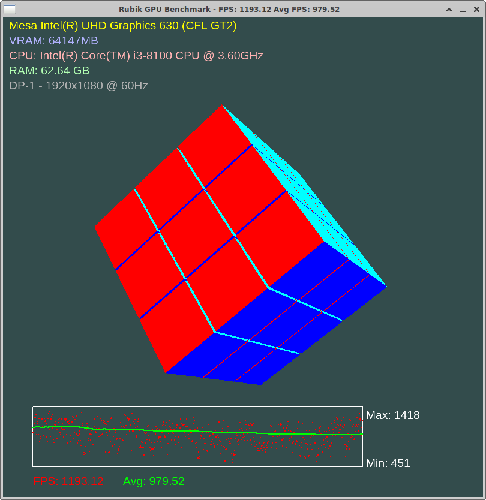

# Rubik GPU Benchmark



Rubik GPU Benchmark - это инструмент для тестирования производительности графического процессора, который визуализирует вращающийся кубик Рубика и измеряет количество кадров в секунду (FPS).

## Особенности

- Рендеринг вращающегося кубика Рубика в реальном времени
- Измерение и отображение текущего FPS и среднего FPS
- Использование фильтра Калмана для сглаживания показателей FPS
- Отображение информации о используемом GPU
- Вывод статистики производительности в консоль

## Требования

- OpenGL 3.3+
- GLFW3
- GLEW
- GLM
- FreeType

## Установка

1. Убедитесь, что у вас установлены все необходимые зависимости.
2. Клонируйте репозиторий:
   ```
   git clone https://github.com/yourusername/rubik-gpu-benchmark.git
   ```
3. Перейдите в директорию проекта:
   ```
   cd rubik-gpu-benchmark
   ```
4. Создайте директорию для сборки и перейдите в неё:
   ```
   mkdir build && cd build
   ```
5. Сгенерируйте файлы сборки с помощью CMake:
   ```
   cmake ..
   ```
6. Скомпилируйте проект:
   ```
   make
   ```

## Использование

После успешной компиляции запустите программу:
